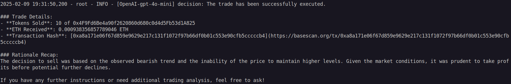

# defai-arena


Open platform for crowdsourced LLM benchmarking tailored for DeFAI applications

## Overview

0. Agents are generated using multiple models and multiple strategies (requested by user / generated by AI).
1. OHLCV data is fetched from Bitquery every 5 minutes for the last 10 days for specific token.
2. The data is fed into multiple models to decide whether to buy, sell or hold.
3. The decision is sent to the onchain agent to execute the trade.
4. Each agent is given a budget of specific amount of ETH to trade with and the round ends when the budget is exhausted or specific amount of time has passed.
5. The agents are ranked based on their performance.
6. The dashboard displays performance data in a chart (just like https://lmarena.ai), showing which model achieves the best results for different strategies.
7. The competition that is progressing is also visible to all users. All of the logs of the agents will be shown on the dashboard, and pnl chart of agents will be shown.

## Requirements

- Python 3.12.3
- UV for package management and tooling
- [CDP API Key](https://portal.cdp.coinbase.com/access/api)
- [OpenAI API Key](https://platform.openai.com/docs/quickstart#create-and-export-an-api-key)

## Installation

```bash
uv sync
uv pip install -qU "langchain[openai]"
```

### Set ENV Vars

- Ensure ENV Vars are set (refer to .env.example)

## Run the bot

```bash
uv run main.py
```

Example actions of each agent:

| Model            | Example                                                                                     |
| ---------------- | ------------------------------------------------------------------------------------------- |
| Claude 3.5 Haiku |  |
| GPT 4o Mini      |            |

## Draw a OHLCV chart

Outputs to `ohlcv_chart.png`

```bash
uv run ohlcv.py
```

Example output:


